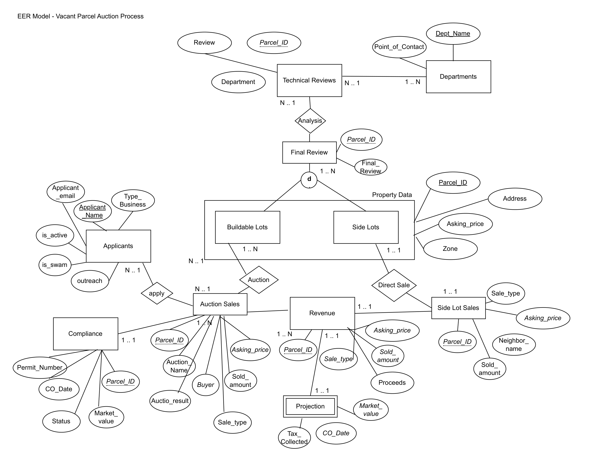
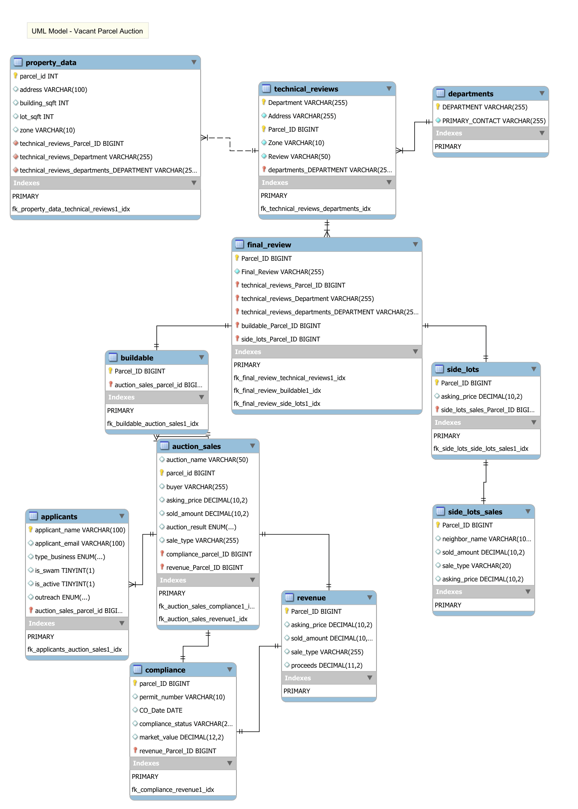

# Vacant Land and Auction Process Database

A relational and NoSQL database modeling a city's vacant land disposition 
and auction process, built for a Data Management for Analytics course 
at Northeastern University.

## The Problem
A fictional city needs to inventory, assess, and dispose of city-owned 
vacant land to boost housing supply. Parcels go through departmental 
reviews, get classified as buildable or side lots, and are sold via 
public auction or directly to neighbors.

## What This Project Does
- Designs a relational database from scratch (EER and UML diagrams)
- Tracks parcels through the full review and auction pipeline
- Identifies non-compliant buyers using MongoDB aggregation pipelines
- Connects MySQL to Python for reporting and visualization

## Database Schema

## Stack
MySQL · MongoDB · Python · SQLAlchemy · pandas · seaborn · matplotlib

## Files
- `project_v1.sql` — full schema, data, and queries
- `mongodb_queries.js` — aggregation pipelines and MapReduce
- `python_analysis.py` — MySQL/Python connection and visualizations
